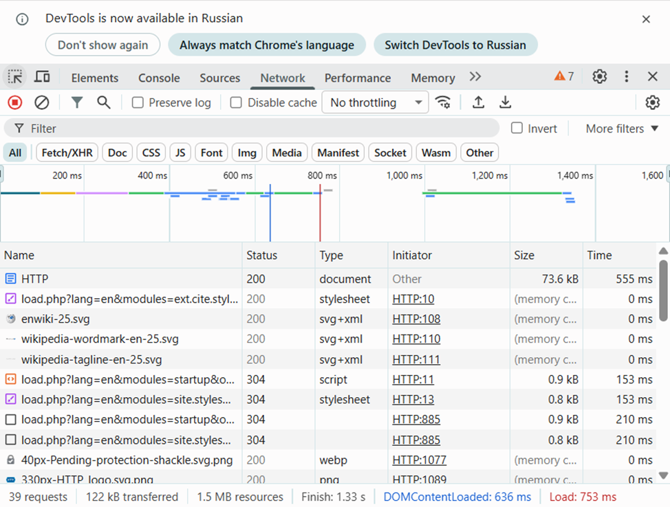
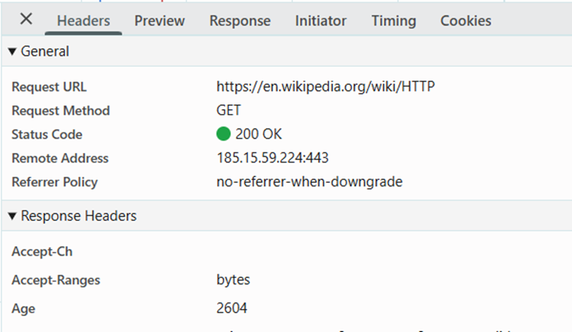
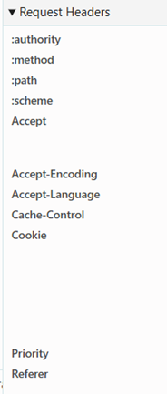
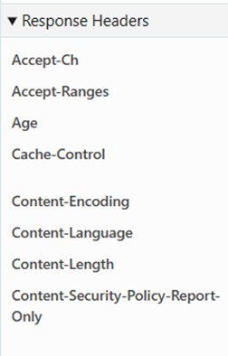
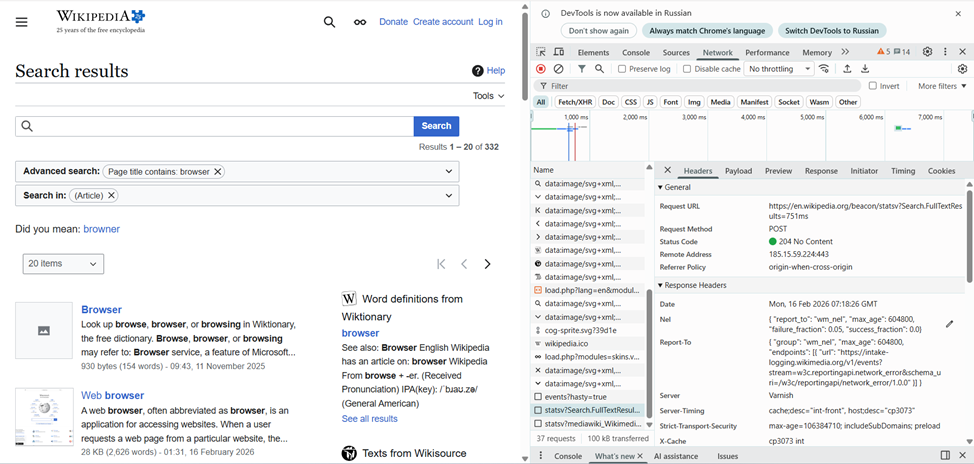

# Молдавский Государственный Университет  
## Факультет Математики и Информатики  
### Департамент Информатики  

---

# Отчет по лабораторной работе по дисциплине „PHP”

### **Выполнил:** студент группы IA2403  
**Codjebas Oleg**

### **Проверил преподаватель:**  
**Visnevschi Vlada**

**Кишинев, 2026**

---

# Цель работы
1. Понять, что происходит при открытии веб-страницы.  
2. Научиться находить и анализировать HTTP-запросы в браузере.  
3. Разобраться в назначении методов GET, POST, PUT, DELETE.

---

# Задание 1. Анализ HTTP-запросов (Часть 1)

## 1. Анализ загрузки страницы Wikipedia  
URL: https://en.wikipedia.org/wiki/HTTP

После открытия страницы и обновления вкладки *Network* был найден первый запрос к странице.




### Метод запроса:
**GET**  
Метод GET используется потому, что браузер запрашивает ресурс для чтения. Он не передаёт данные на сервер и не изменяет состояние ресурса.

### Статус ответа:
**200 OK** — страница успешно найдена и возвращена сервером.

---

## Заголовки запроса (Request Headers)



- **:authority** — домен сайта (кому отправляется запрос).  
- **:method** — метод запроса (**GET**).  
- **:path** — путь страницы на сервере.  
- **:scheme** — протокол (обычно https).  
- **Accept** — форматы данных, которые браузер может принять.  
- **Accept-Encoding** — поддерживаемые типы сжатия (gzip, br).  
- **Accept-Language** — предпочитаемый язык пользователя.  
- **Cache-Control** — инструкции по кэшированию.  
- **Cookie** — данные сессии пользователя.  
- **Priority** — приоритет загрузки.  
- **Referer** — URL, с которого пришёл пользователь.

---

## Заголовки ответа (Response Headers)



- **Accept-CH** — какие дополнительные данные браузера сервер может запрашивать.  
- **Accept-Ranges** — поддержка частичной загрузки файлов.  
- **Age** — сколько секунд ответ находится в кэше.  
- **Cache-Control** — правила кэширования.  
- **Content-Encoding** — метод сжатия (gzip, br).  
- **Content-Language** — язык страницы.  
- **Content-Length** — размер содержимого.  
- **Content-Security-Policy-Report-Only** — политика безопасности.

---

## Тело запроса и ответа
- У GET-запроса тело отсутствует.  
- Ответ содержит HTML-код страницы.

---

## Дополнительные запросы при загрузке страницы
- CSS-файлы  
- JavaScript-скрипты  
- Изображения  
- Шрифты  
- API-запросы для интерфейса

---

## Анализ ошибки страницы  
URL: https://en.wikipedia.org/wiki/HTTPdsfdfs

**Статус ответа:**  
**404 Not Found** — статья не существует.  

Ответ содержит HTML-страницу с уведомлением об ошибке.

---

# Задание 2. Анализ запроса поиска на Wikipedia

URL: https://en.wikipedia.org/wiki/Special:Search  
Поисковый запрос: **browser**

В *Network* найден соответствующий запрос, отправленный при выполнении поиска.



---

# Задание 3. Анализ любого сайта (google.com)

## Основной запрос
- **URL:** https://www.google.com/  
- **Метод:** GET  
- **Статус:** 200 OK  

Ответ содержит HTML главной страницы Google.

## Дополнительные запросы
- JavaScript (translate.js, consent.js)  
- Иконки  
- CSS  
- XHR-запросы (подсказки поиска)

---

# Составление HTTP-запросов

### GET-запрос
```http
GET / HTTP/1.1
Host: sandbox.usm.com
User-Agent: Oleg Kodzhebash
```

### POST-запрос
```http
POST /cars HTTP/1.1
Host: sandbox.usm.com
Content-Type: application/x-www-form-urlencoded
User-Agent: Oleg Kodzhebash

make=Toyota&model=Corolla&year=2020
```

### PUT-запрос
```http
PUT /cars/1 HTTP/1.1
Host: sandbox.usm.com
Content-Type: application/json
User-Agent: Oleg Kodzhebash

{
  "make": "Toyota",
  "model": "Corolla",
  "year": 2021
}
```

---

# Разница между PUT и PATCH

### PUT
- Полностью заменяет объект.  
- Если поле не указано — оно удаляется.  
- Идемпотентен (повторный запрос даёт тот же результат).

### PATCH
- Частично обновляет данные.  
- Меняет только переданные поля.  
- Может быть неидемпотентным.

---

# Основные HTTP-методы

| Метод | Назначение |
|-------|------------|
| **GET** | Получение данных |
| **POST** | Создание данных / отправка форм |
| **PUT** | Полная замена объекта |
| **PATCH** | Частичное обновление объекта |
| **DELETE** | Удаление ресурса |
| **HEAD** | Только заголовки |
| **OPTIONS** | Доступные методы сервера |

---

# Основные коды состояния HTTP

- **200 OK** — запрос успешно выполнен.  
- **201 Created** — объект создан.  
- **400 Bad Request** — ошибка в данных запроса.  
- **401 Unauthorized** — требуется авторизация.  
- **403 Forbidden** — нет прав.  
- **404 Not Found** — ресурс не найден.  
- **500 Internal Server Error** — ошибка сервера.