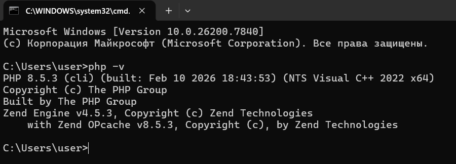
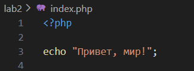
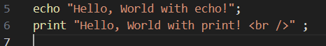
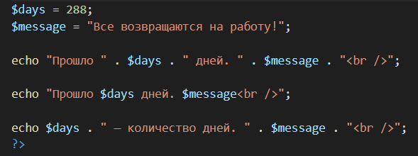
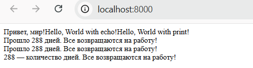

# Лабораторная работа №2
## Установка PHP и создание первой программы

**Выполнил:** Codjebas Oleg 
**Дата:** 19.02.2026

---

## Ход выполнения работы

### Шаг 1. Установка PHP

1. С официального сайта php.net/downloads была скачана актуальная версия PHP.
2. Архив распакован в директорию: C:\Program Files\php
3. Путь к PHP добавлен в системную переменную Path:
   - Нажата комбинация клавиш Win + R, введена команда sysdm.cpl
   - Открыта вкладка «Дополнительно» → «Переменные среды»
   - В системной переменной Path добавлена строка: C:\Program Files\php
4. Изменения сохранены.
5. Выполнена проверка установки командой php -v

**Вывод:** установка PHP выполнена успешно.

---

### Шаг 2. Создание директории проекта

Создана директория проекта: C:\Desktop\PHP\lab2

---

### Шаг 3. Создание первой программы

В директории проекта создан файл index.php с кодом, выводящим строку "Привет, мир!".

**Результат:** на экран выведена строка "Привет, мир!".

---

### Шаг 4. Вывод данных в PHP

В файл index.php добавлен код с использованием операторов echo и print для вывода строк.

**Результат:** строки успешно выведены обоими операторами.

---

### Шаг 5. Работа с переменными и выводом

В программу добавлены переменные:
- $days = 288
- $message = "Все возвращаются на работу!"

Выполнен вывод значений переменных тремя способами:
1. С помощью конкатенации (оператор .)
2. С помощью интерполяции в двойных кавычках
3. Дополнительный вариант вывода

**Результат:** все три способа вывода отработали корректно, отобразив значения переменных.

---

## Итоговый результат

Все поставленные задачи выполнены:
- Установлен и настроен PHP
- Создана первая программа
- Изучены операторы echo и print
- Освоены различные способы вывода переменных

---

## Вывод

В ходе выполнения лабораторной работы были получены практические навыки установки PHP, создания первой программы и работы с основными конструкциями языка. Все задания выполнены в полном объеме.

## Ответы на контрольные вопросы

**Вопрос 1.** Какие способы установки PHP существуют?

**Ответ:** Существует несколько способов установки PHP:
- **Официальный сайт** — скачивание дистрибутива с php.net и ручная настройка (распаковка архива, прописывание путей в переменные среды).
- **Установка в составе готовых сборок** — OpenServer, XAMPP, WAMP, MAMP (включают PHP, Apache, MySQL).
- **Использование Docker** — запуск PHP в контейнере без установки на локальную машину.

---

**Вопрос 2.** Как проверить, что PHP установлен и работает?

**Ответ:** Проверить установку PHP можно следующими способами:
- В командной строке (терминале) выполнить команду: `php -v`. Если PHP установлен, отобразится информация о версии.
- Создать файл `info.php` с содержимым `<?php phpinfo(); ?>` и открыть его через веб-сервер. Должна отобразиться подробная информация о конфигурации PHP.
- Выполнить простой скрипт: `php -r "echo 'PHP работает!';"`. Если PHP установлен, в консоли появится сообщение "PHP работает!".

---

**Вопрос 3.** Чем отличается оператор echo от print?

**Ответ:** Основные отличия операторов `echo` и `print`:
- **Возвращаемое значение:** `print` всегда возвращает 1, поэтому может использоваться в выражениях. `echo` ничего не возвращает.
- **Скорость:** `echo` работает немного быстрее, так как не возвращает значение.
- **Синтаксис:** `echo` может принимать несколько параметров через запятую (`echo "текст1", "текст2";`), `print` принимает только один аргумент.
- **Использование:** `echo` чаще используется для обычного вывода текста, `print` — в редких случаях, когда требуется возвращаемое значение.
---

