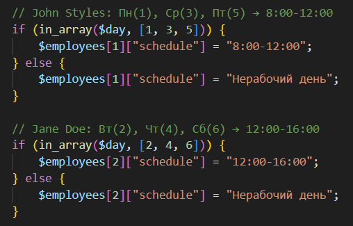
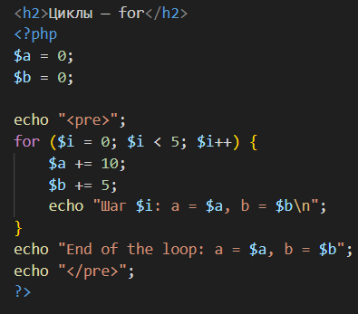
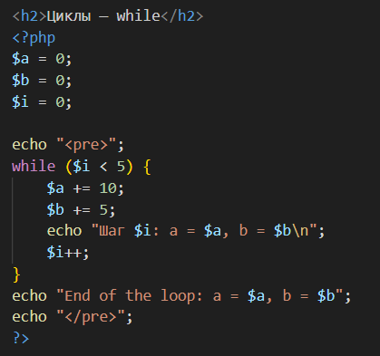
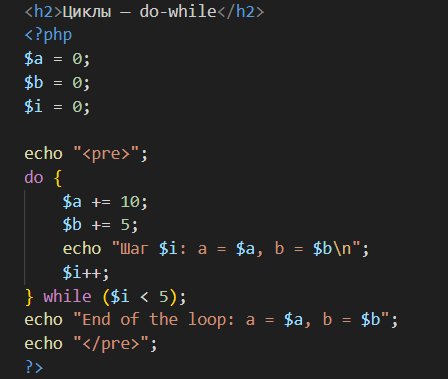
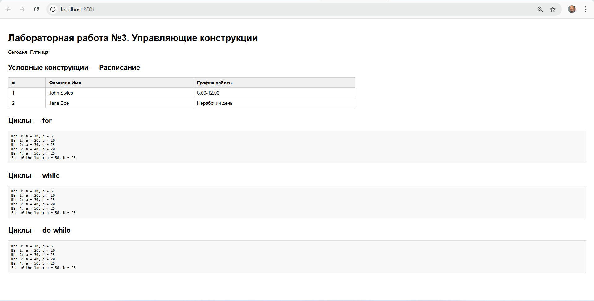

# Лабораторная работа №3. Управляющие конструкции

**Выполнил:** Codjebas Oleg  
**Дата:** 27.02.2026  
**Язык:** PHP  

---

## Цель работы

Изучить управляющие конструкции языка PHP: условные операторы (`if`, `else`, `in_array`) и циклы (`for`, `while`, `do-while`). Научиться использовать функцию `date()` для получения текущего дня недели и формирования динамического расписания.

---

## Задание 1. Условные конструкции

### Описание

С помощью функции `date()` создать таблицу расписания сотрудников, формируемую на основе текущего дня недели.

**Условия:**
- **John Styles** — работает в **понедельник, среду и пятницу** с `8:00` до `12:00`. В остальные дни — *Нерабочий день*.
- **Jane Doe** — работает во **вторник, четверг и субботу** с `12:00` до `16:00`. В остальные дни — *Нерабочий день*.



| Функция / Конструкция | Назначение |
|---|---|
| `date("N")` | Возвращает номер дня недели (1 = Пн ... 7 = Вс) |
| `in_array($day, [...])` | Проверяет, входит ли день в заданный список |
| `if / else` | Выбирает нужный график или выводит «Нерабочий день» |

### Результат

| # | Фамилия Имя | График работы |
|---|---|---|
| 1 | John Styles | 8:00-12:00 *(пн/ср/пт)* или Нерабочий день |
| 2 | Jane Doe | 12:00-16:00 *(вт/чт/сб)* или Нерабочий день |

---

## Задание 2. Циклы

### Описание

Реализовать накопление значений переменных `$a` и `$b` в цикле с выводом промежуточных результатов. Цикл выполняется **5 итераций**: на каждом шаге `$a` увеличивается на `10`, `$b` — на `5`.

---

### 2.1 Цикл `for`



### 2.2 Цикл `while`



### 2.3 Цикл `do-while`



### Сравнение циклов

| Цикл | Проверка условия | Особенность |
|---|---|---|
| `for` | До выполнения тела | Удобен когда число итераций известно заранее |
| `while` | До выполнения тела | Удобен когда число итераций заранее неизвестно |
| `do-while` | После выполнения тела | Тело выполняется **минимум 1 раз** |

---

## Запуск проекта

**Требования:** PHP 7.4+

# 1. Перейти в папку с файлом
cd путь/к/папке

# 2. Запустить встроенный сервер PHP
php -S localhost:8001

# 3. Открыть в браузере
http://localhost:8001

### Вывод 



## Вывод по лабораторной работе

В ходе выполнения лабораторной работы были изучены управляющие конструкции PHP. Реализованы условные операторы для формирования динамического расписания на основе текущего дня недели с использованием функции `date()`. Также реализованы три вида циклов (`for`, `while`, `do-while`), демонстрирующих накопление значений переменных — все три дают идентичный результат, но отличаются синтаксисом и моментом проверки условия.

# Ответы на вопросы

---

## 1. Разница между `for`, `while` и `do-while`

**for** — используется когда количество итераций известно заранее. Счётчик, условие и шаг записываются прямо в заголовке цикла.

**while** — используется когда количество итераций заранее неизвестно. Условие проверяется **до** выполнения тела, поэтому если условие сразу ложно — тело не выполнится ни разу.

**do-while** — отличается от while тем, что условие проверяется **после** тела. Это гарантирует, что тело выполнится **минимум один раз**, даже если условие изначально ложно.

---

## 2. Тернарный оператор `? :`

Это сокращённая запись `if / else` в одну строку. Синтаксис:
```
условие ? значение_если_true : значение_если_false
```

Например, вместо:
```php
if ($age >= 18) {
    $status = "совершеннолетний";
} else {
    $status = "несовершеннолетний";
}
```

Можно написать:
```php
$status = ($age >= 18) ? "совершеннолетний" : "несовершеннолетний";
```

Удобен для коротких условий. Для сложной логики лучше использовать обычный `if / else` — код будет читаемее.

---

## 3. `do-while` с изначально ложным условием

Тело цикла **всё равно выполнится один раз** — это главная особенность `do-while`. Условие проверяется только после первого прохода, поэтому даже `while (false)` не остановит первую итерацию.

Это принципиальное отличие от `while` и `for` — те вообще не войдут в тело если условие ложно с самого начала.